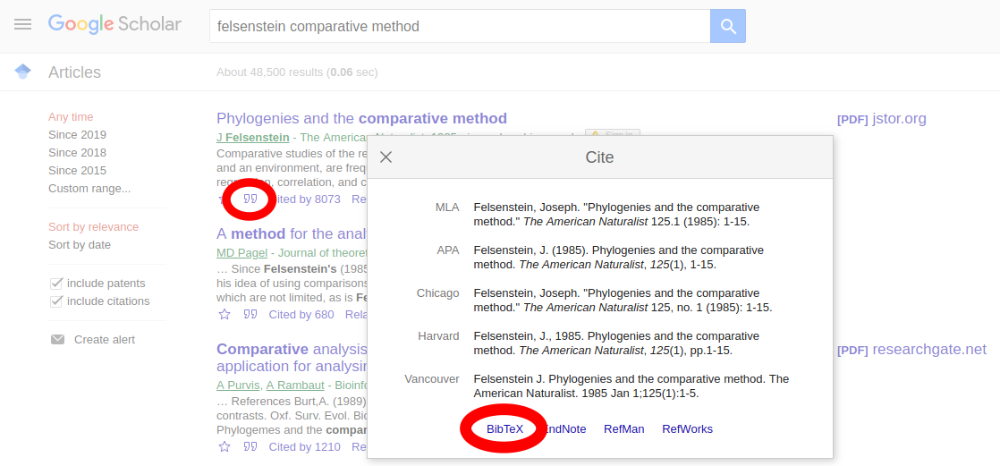

# panandbib
A collaborative annotated bibliography for panand project.

Some guidelines for contributing to the panand.bib

- To contribute, follow the proper protocols to submit pull requests. [Here's a nice how-to](https://kbroman.org/github_tutorial/pages/fork.html). Note you should use [Silas's version](https://github.com/silastittes/panandbib) when you `add remote`.

- All entries should have keys that are `abc` where `a` is the last name of the first author, `b` is the full year, and `c` is the first word of the title. All words (including author last name) should be lowercase (look over the `panand.bib` file for examples).

- Make sure the format is correct. [Here's a nice guide](https://www.andy-roberts.net/res/writing/latex/bibentries.pdf) of the allowable entries and fields for bib format. Proper format can be verified with:

```
biber --tool -V panand.bib
```

- Please include succinct but thorough notes in the `annote` field (see `panand.bib` for examples). Always add `annote` as the very last field (so it's easier to find). Adding details to an exiting `annote` is encourged.


- Avoid and remove overlapping entries.


-  There are a lot of ways to get a bib entry started. One easy approach is from Google Scholar. Find the desired paper, click the double quote icon under the main link, then click the BibTeX link from the pop-up page. From there, copy and paste the entry into the `panand.bib` file, add an `annote` field, and edit other fields as required.


 
